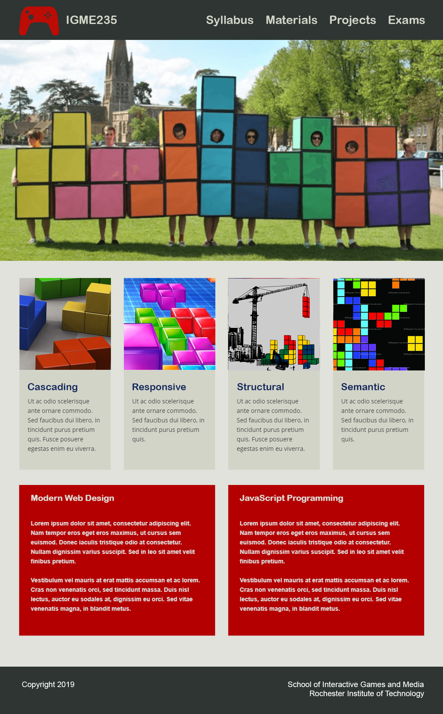

# Homework: Design to Spec

## I. Overview
Web developers commonly work in a team with others such as Content Strategists, User Experience designers, and Graphic Artists.  For this homework, you are being asked to recreate this design that a Graphic Artist built in Photoshop.  Your Goal is to use HTML & CSS (but no frameworks such as Bootstrap or Materialize) to realize this site as a functional web page.

## II. Requirements
You are to recreate this design:

This is decidedly NOT a Homework for you to exercise your creativity.

You will be graded on how close you are able to get your page to the appearance of this image.

This is an individual project, and since everyone is doing the EXACT SAME design, you should guard your code carefully so that it is not made available to others.  We will run a file similarity checker on all submissions for this exercise across all sections to look for instances of academic dishonesty.  There is enough ambiguity in the design and the ways that it gets implemented that everyone's project can certainly be unique.

The only requirements about the way that your design is implemented is that it must either Flexbox, CSS Grid, or (most likely) both of them to do page layout.

You must also use valid, semantic, HTML & valid CSS stored in an external css file.

The Graphic artist has NOT specified a certain design for mobile, but they would definitely like to see you provide a Responsive Design solution that works well.

The Graphic artist has also NOT specified certain behaviors on the page such as link colors or rollover states for menu links.  You're free to make your own determinations, but don't go far outside of the provided color palette. 

QUESTIONS?  It is not uncommon to need to ask questions of the Graphic Designer so that you get the clearest understanding of the spec.  For the purposes of this assignment, the Graphic Designer will be your course Instructor and spec clarification questions should be asked in YOUR SECTION'S channel.  You can still ask general HTML & CSS questions in the shared html-css-questions channel on Discord, but always be careful not to share your (nearly complete) code to the rest of the class.

If you run into trouble and wish to seek help with a specific question that requires the sharing of your code, do so through a private message to your Instructor.

## III. NON Requirements
- You do not need to guess at page colors.  They are all (except for white and black) specified in included color palette.  
- It is not necessary to crop the images in exactly the same way as the original images, however, we are providing the original images so that they can match more easily.
- There are no specific pixel dimensions for items on the page.  You're probably best of specifying most elements to be flexible in size and/or based off of the rem unit.
- You should use the same Heading Text that we provided, however you do not need to use the same placeholder code.  Use VS Code or another tool to generate "Lorem Ipsum" text for you to hold the spaces open.  In VS Code, just type `loremNN` where NN is a number of words that you want followed by Enter, and it will generate a block of text for you.

## IV: Submissions
- You should post your Homework in a subdirectory of your 235 page.  Use a unique folder name (there should be no way to get to it easily from your 235 Home Page).  Zip your files together and upload them to the assignment on myCourses (when it is created), and include a URL to the live version of your page in the comments field.

