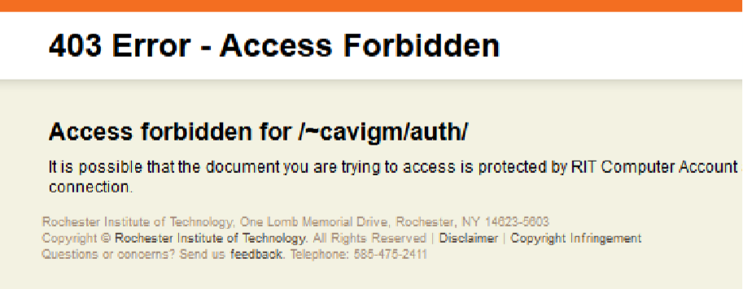
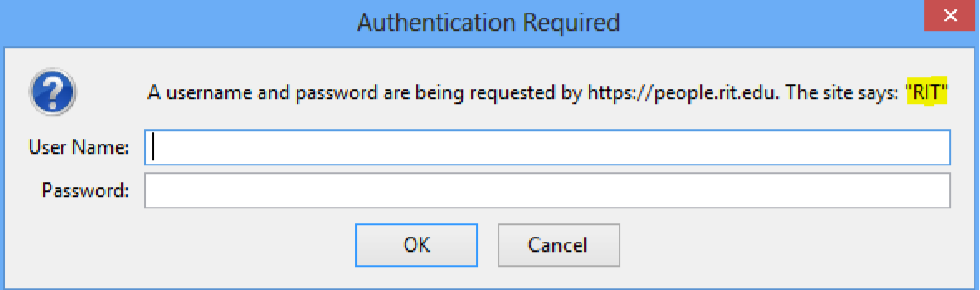

# Homework: Custom 404 and Auth

The overall goal of this exercise is to get some exposure to what’s happening on our Web server, and learn how to set up custom 404 pages and basic authentication for Web pages. 
 
## Exercises:  
 
1. Set up a Custom 404 Page using htaccess 
1. Set up default page using htaccess 
1. Set up basic authentication using htaccess 

## Download Starter Files:

1. Download [the starter files](htaccess-starter-files.zip) for this exercise. (Caution! Don't just right-click this link and save as.  It won't work.  First click through to see the file in the repository. Then click the **Download** button in the top right to get a copy.  Clicking the "View raw" link in the middle of the page can have unexpected results).

2. Set up your 235 Directory (if you haven't done so already) 

    1. On your PC, create a directory called **235**. This is where all the work you do from now on will be stored. 
    1. Make sure to save this to a flash drive, your myCourses locker, GitHub, a remote disk, or some other means of backup. Be sure to keep 2 backups: on a removable device (for instance) and some other means in case something happens to that one.  
    3. Connect to Banjo using FileZilla or another FTP client
        - Legacy Notes: [How to post to RIT's *banjo* web server](https://github.com/tonethar/IGME-235-Shared/blob/master/notes/posting-to-banjo.md)
    4. Drag your 235 folder into your www folder on Banjo. Make sure it has the right permissions (on FileZilla, right-click > File Attributes… > Numeric Value: 755) 
 
## Set up Basic Authentication using htaccess 

Now let’s go back to the starter files you downloaded for this exercise. 
 
1. Open **error.html** in a web browser. This will be our custom error page any time the server does not find a page. 
 
1. Open **noterror.html** in a browser. This will be used as a test page that will not give us an error. 
 
1. Connect to Banjo using FileZilla or another FTP client 
 
1. In your **235** folder on Banjo, create a new folder called **error**.  (your FTP client will have a command to do this, probably involving a right-click)
 
1. Add the starter files from the **error_start** folder to the new **error** folder you created. Your **error** folder should only contain 3 files. 
 
1. Make sure you can reach the **error.html** page and the **noterror.html** pages from a browser. Correct any permissions issues if you need to. (Numeric Value: 644 -- same for the **hypnotoad.gif**)
    - Note:  The URL to the files that you just uploaded to banjo will be in this pattern:  `http://people.rit.edu/youruserid/235/error/filename.html` 
 
1. Now create a new file (a plain text file) called **.htaccess** . The dot at the beginning of the file name is critical. The dot at the beginning tells unix machines that this is a hidden file.
    - That said, to work with a file that has a dot at the beginning on your local computer may be problematic.  You can get around these particular issues by leaving the dot off (or temporarily calling it htaccess.txt) while the file is local and then renaming it through the FTP interface after you upload it.
 
    Apache servers look for hidden server configuration files called **.htaccess**. 
 
    The **.htaccess** file allows you to set custom configurations for a folder or subfolders.  
 
    Apache looks for one **.htaccess** file per folder. That sets the configuration for that folder and any sub-folder. Having **.htaccess** files in sub-folders can override **.htaccess** files in above folders.  
 
1. Now we will add the Apache commands to set up the custom 404 page when 404 errors occur.  
 
    We will use the `ErrorDocument` directive. Apache’s `ErrorDocument` directive tells Apache how to handle specific errors. It takes an HTTP status code and a response to send. 
 
    The status code we will be handling is 404 – the file not found status code.  
 
    You can find more status codes here: http://en.wikipedia.org/wiki/List_of_HTTP_status_codes  
 
     For a response, we will give Apache the path of an HTML file to send. The file path for this directive is similar to your people.rit.edu path in a browser. You start with **/abc1234** (where abc1234 is your RIT ID), which is automatically linked to your **www** folder. After that, it’s just the path to your file inside of the **www** folder.
 
     Inside of your **.htaccess** file, add the following line. Replace `abc1234` with your ID.  
 
    `ErrorDocument 404 /abc1234/235/error/error.html`
 
1. Transfer this file to the **error** folder you made on Banjo.  (Rename it to **.htaccess** if necessary)
 
1. Test your new 404 error page. Go to the **noterror.html** page on Banjo. Make sure you can get to that page.  
 
1. Once you get to that page, try a non-existent page in the **error** folder. Change the browser URL from **noterror.html** to maybe **notreal.html**. 
 
    You should automatically be sent to the 404 page you added any time you type in an address that does not exist in the **error** folder.  
    This only affects the **error** folder and any folders inside of it because that is where the htaccess file is. If you test any non-existent pages above the error folder, you should still get the normal RIT 404 page. 
    - Test this to make sure... We don't want this error page coming up when we go straight to your **235** folder!
 
**Note:** If this does not work, check the name & capitalization of the **.htaccess** file. Then inside of the **.htaccess** file, check the path to your **error.html** file. It must be exact or else Apache will give you a default error page. 

## Set up Default Page using htaccess 
 
1. Open the previous **.htaccess** file you made from the previous exercise.  

1. Now we will add the `DirectoryIndex` directive to our htaccess file.  
 
    The `DirectoryIndex` directive tells Apache what page to use as the index page for this folder. By default Apache just looks for pages named **index.html**. The index page is the page that loads any time a browser goes to that folder without specifying a specific page. 
 
    The `DirectoryIndex` directive takes a file name to load from the same folder. 
 
    Add this line to your **.htaccess** file: 
 
    `DirectoryIndex noterror.html ` 
 
1. Transfer the updated file to Banjo (in the same location as before -- overwrite, or delete/upload/rename as necessary). Note that up to this point we are working entirely in the error directory; this **.htaccess** file should not exist outside that folder. 

1. Now test the new index in a browser. Go to your error directory in a browser, but do not specify the page. It should automatically show you the noterror.html page, but you will not see the file name in the browser.  
 
This is a nice simple way of setting a default page that you can quickly change without altering any of your HTML files.  
 
**Note:** If you are having problems, make sure you check the spelling and capitalization  
 
## Set up Basic Authentication using htaccess 
 
Now we will create a password protected directory using authentication. 
 
1. In your 235 folder on Banjo, create a new folder called **auth**. 
 
2. Once created, transfer the **myPage.html** start file (from auth_start) to that folder on Banjo.  
 
3. Make sure you can get to the **myPage.html** page on Banjo from a browser. Correct any error or permissions issues.  
 
4. Since this **auth** directory is a new folder, we will use a whole new **.htaccess** file in it. Go ahead and create another .htaccess file.  
 
5. Inside of the new .htaccess file you just created, we will add some directives for handling authentication. 
 
    We will set up the authentication so that any RIT user can access the content. 
 
    Here are the directives we will be using.  
 
    `AuthType` – This tells Apache which type of authentication to use  
    `AuthName` – This is the name of the service displayed to users so they know what to login with. The browser message will say something like “ login with your _____ account ”  
    `SSLRequireSSL` – This tells Apache to require SSL (HTTPS://) in order to access the page. If the page is accessed with HTTP instead of HTTPS, the server will return an error.  
    `ShibRequireSession` – This is a variable specific to our server environment, which we'll use to force the auth to use RIT's “ shibboleth ” server  
    `Require` – This tells Apache which type of users to allow. This can be configured to only allow access to certain groups or users. 
 
    Inside of your new .htaccess file, add the following.  
 
    ```
    AuthType shibboleth 
    AuthName "RIT" 
    ShibRequireSession On 
    SSLRequireSSL 
    require valid-user
    ```
 
    The code above tells Apache to use authentication via RIT’s own service named Shibboleth. It tells the browsers that the service is called RIT. Finally, this requires “valid-user” which means anyone who was successfully able to login to the service. 
 
    If you want to find out more, check out Apache’s documentation here - http://httpd.apache.org/docs/2.2/mod/core.html  
 
6. Upload your new **.htaccess**. file to your **auth** folder on Banjo.  
 
7. If you were to load this page under normal circumstances via HTTP:, you should get something similar to this: 
 
    
 
    Since we used the `SSLRequireSSL` directive Apache won’t even serve the login option to a non-https connection. However, Banjo automatically enforces secure connections via HTTPS, so you’re not likely to see this! 
 
    In the recent past, you'd get something like the window below depending on which browser you used. The image below is from Firefox. In Firefox, it displays the `AuthName` directive from **.htaccess** at the end of the login prompt (highlighted below for reference).
    
    
    
    However, today, with RIT's 2-factor authentication, the user is sent to an entirely different web page for authentication.  The experience your user gets will be dependent upon the webserver your pages are hosted on.

8. Go ahead and login with your RIT account.  (Actually you probably already were -- Maybe try to hit your page with an Incognito/Private browser window and see what happens).
 
9. Once you are logged in however, you should be able to get to the page. 
  
## Submission 
You will do the following in the Assignments section of your myCourses shell.

- Submit links to the following (on Banjo): 
    - Link to a non-existent page so that your 404 page automatically loads.
    - Link to the error directory, so that the noterror page automatically loads.
    - An https link to your auth page, so that login comes up.
