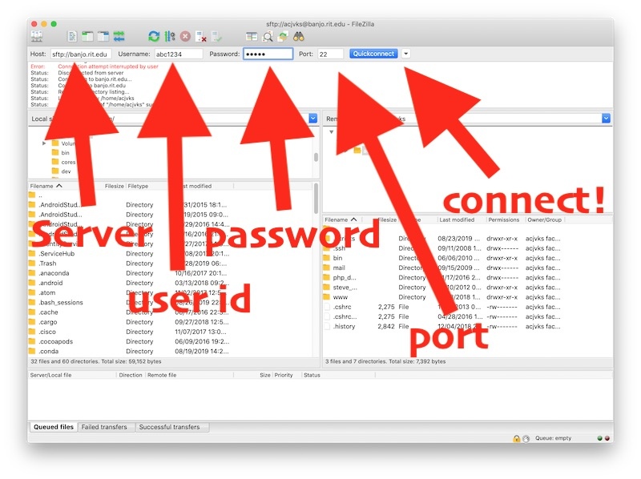
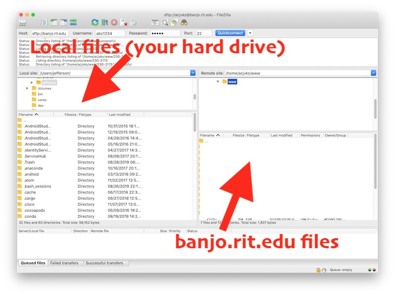
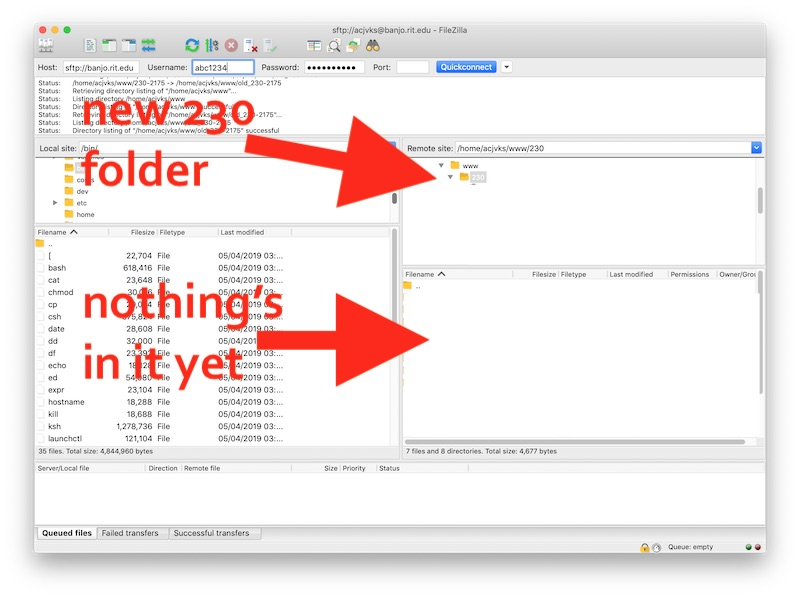
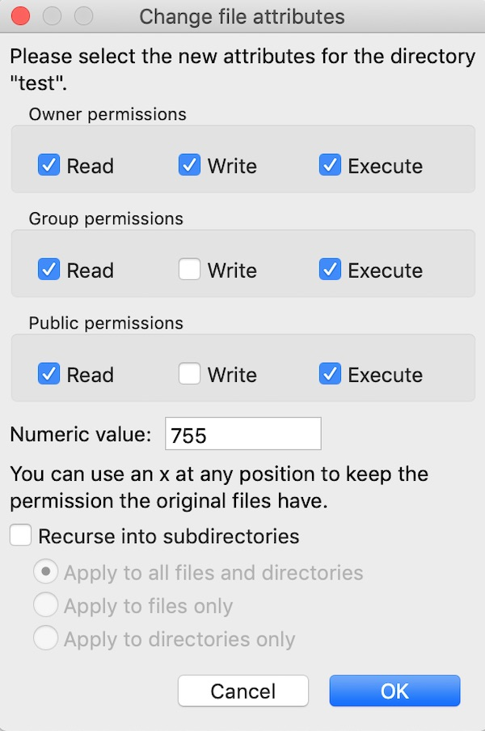
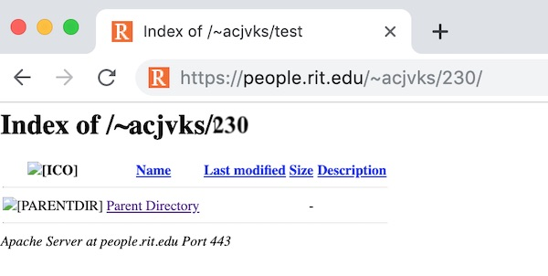
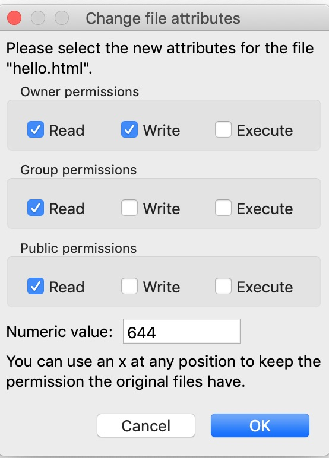

# Core Skills: FTP File Upload Walkthough

*Let's review creating a simple web page, and putting it out on the web for the whole world to see!*

 I. [Create a Simple Web Page](#partI)
 
 II. [FTP Overview](#partII)
 
 III. [Connect to the banjo.rit.edu server](#partIII)
 
 IV. [Create a 230 folder](#partIV)
 
 V. [Set the Unix file permissions for your 230 folder](#partV)
 
VI. [Verify that your 230 folder is visible on the web](#partVI)

VII. [Post hello.html to the web](#partVII)

VIII. [Verify that your hello.html file is visible on the web](#partVIII)

IX. [Reference](#partIX)

<hr><hr>

*Note: If you are in a section of IGME-110, IGME-235 or IGME-330, you can substitute all references to the number `230` below with the appropriate number for your course :-)*

<a id="partI"/>

## I. Create a Simple Web Page

1) Fire up a text editor such as NotePad++ or Visual Studio Code and create and save the following file. NOTE: *Be sure to use **type** "plain text" or "HTML"; do NOT create web pages of type "rich text"*

**hello.html**

```html
<!DOCTYPE html>
<html lang="en">
<head>
	<meta charset="utf-8" />
	<title>Hello Page</title>
	<style>
	h1{
	  font-family:sans-serif;
	}
	
	p:first-of-type{
		font-style:italic;
	}
	</style>
</head>
   <body>
      <h1>Week 1 in 230!</h1>
      <p>We will be learning a lot this semester!</p>
      <p>Course GitHub is here: <a href="https://github.com/tonethar/IGME-230-Fall-2019">IGME-230 Fall 2019</a></p>
      <!-- 	This simple page actually has a lot going on in it! -->
      <!-- 	These are HTML comments that is not visible in the browser window -->
   </body>
</html>
```

2) Now open the page up in a web browser, it should look something like this:


<hr>

<a id="partII"/>

## II. FTP Overview

- In order to share our web page with the world, we are going to have to upload the HTML file to a *web server*
- What is a web server? It's a computer that is connected to the Internet, that runs specialized software (ex. [Apache HTTP Server](https://en.wikipedia.org/wiki/Apache_HTTP_Server)) that stores and serves up the various files (HTML, CSS, images,JavaScript ...) that make up a web page.
- `banjo.rit.edu` is the address of the web server that hosts files for people.rit.edu, which is where your personal RIT account is located 
- **FTP** stands for **File Transfer Protocol** - which is a way of transferring files between computers that are connected on the Internet
- *Filezilla* is an *FTP client* application that makes it easy to upload and download files to and from a web server

<hr>

<a id="partIII"/>

## III. Connect to the banjo.rit.edu server

1. Fire up *Filezilla* (which is on the lab PCs) or a similar FTP client
2. FTP clients need 4 pieces of information before they can connect to a server
- the **address** of the server to connect to (for today this is ***`banjo.rit.edu`***)
- the **user id** of the account where you want to post files (your RIT ***`abc1234`*** id)
- the **password** of the account (your ***password***)
- the **port** you wish to connect to (this is ***`22`*** which is SFTP - "Secure FTP")
- now "make it so" by clicking the **Quickconnect** button!!




<hr>

<a id="partIV"/>

## IV. Create a 230 folder

- Now that you are connected, you can see your computer's files on the left side of the screen, and the banjo.rit.edu files on the right
- Go ahead and click on the folders on the right side of the Filezilla window so that the **`www`** folder is selected
- This is what you should see:



- **Important:** Files that are going to be visible on the web *must* be placed either directly in the **`www`** folder or one of its sub-folders
- We will now create a new *directory* (aka *folder*) inside of **`www`** to put all of our course materials in. We will give this directory the highly descriptive name of **`230`**
- To accomplish this, perform the following steps:
  - With the **`www`** folder selected, go ahead and right-click and choose "Create Directory" from the pop-up menu
  - Name the new directory **`230`**
  - This is what you should see:



<hr>

<a id="partV"/>

## V. Set the Unix file permissions for your 230 folder

- Now we need to give the web server permission to open this folder and access a listing of the files in it - this is called setting the Unix *file permissions* of the folder. This is something that the FTP client will be able to do for us.
- Go ahead and select the **`230`** folder, right-click,  and choose "File Attributes..."
- Make the attributes of the folder match the screenshot below. These are the correct file permissions anytime you create a folder on banjo:



<hr>

<a id="partVI"/>

## VI. Verify that your 230 folder is visible on the web

- Point a web browser at `http://people.rit.edu/~abc1234/230` (where `abc1234` is your id) - you should see an empty folder like this below. If it doesn't look right, go ahead and ask for help from a neighbor, or the TA or Prof:


 
<hr>

<a id="partVII"/>

## VII. Post hello.html to the web

- This is easy! Head back to Filezilla. With the **`230`** folder selected, just drag the **hello.html** file to the right-most pane in Filezilla, and the **hello.html** file will upload automatically.
- As with the **`230`** folder, you will also need to give the web server *permission* to access the files that you upload. As before, right-click and choose "File Attributes..." for **hello.html** - for files (as opposed to folders) the permissions will usually look like this:



<hr>

<a id="partVIII"/>

## VIII. Verify that your hello.html file is visible on the web

- Point a web browser at `http://people.rit.edu/~abc1234/230/hello.html` (where `abc1234` is your id) - you should see the web page!


<hr>

<a id="partIX"/>

## IX. Reference

- https://en.wikipedia.org/wiki/File_Transfer_Protocol
- https://en.wikipedia.org/wiki/Web_server
- https://mason.gmu.edu/~montecin/UNIXpermiss.htm

<hr><hr>

| \*\*\* -->  **[Return to Core Skills Home](core-skills-home.md)** <-- \*\*\* |
