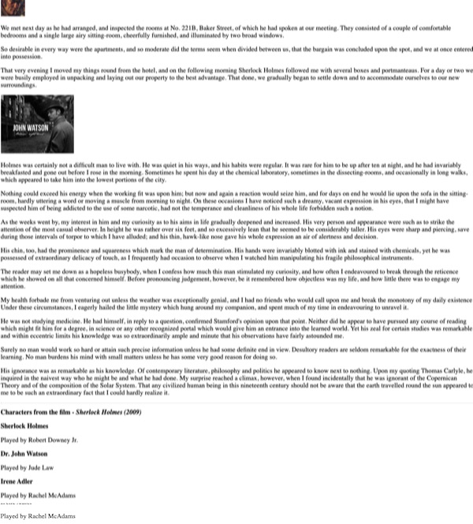

# Holmes Part I

## I. Overview

Your mission (in 3 parts):
  1) take some existing content web content (text & 2 images), and mark it up with appropriate *structural* and *semantic* HTML5 elements in order to make the content more accessible:
    - to *search engines* AND
    - *users* - both users surfing the web with a typical web browser, and those using screen readers
  1) style the content for a typical desktop web browser so that:
    - there is an aesthetic improvement over the default version AND 
    - the page is laid out in a single column layout with a small gutter
  1) use *responsive design* techniques to style the content so that it looks acceptable at typical phone and tablet screen resolutions

## II. Start Files

- here are the image files -->  [holmes-images.zip](_files/holmes-images.zip)
- here is the text content:

**holmes-start.txt**

This is just text - you'll need to add ALL of the HTML elements yourself

```
The Science of Deduction

We met next day as he had arranged, and inspected the rooms at No. 221B, Baker Street, of which he had spoken at our meeting. They consisted of a couple of comfortable bedrooms and a single large airy sitting-room, cheerfully furnished, and illuminated by two broad windows. 

So desirable in every way were the apartments, and so moderate did the terms seem when divided between us, that the bargain was concluded upon the spot, and we at once entered into possession.

That very evening I moved my things round from the hotel, and on the following morning Sherlock Holmes followed me with several boxes and portmanteaus. For a day or two we were busily employed in unpacking and laying out our property to the best advantage. That done, we gradually began to settle down and to accommodate ourselves to our new surroundings.

Holmes was certainly not a difficult man to live with. He was quiet in his ways, and his habits were regular. It was rare for him to be up after ten at night, and he had invariably breakfasted and gone out before I rose in the morning. Sometimes he spent his day at the chemical laboratory, sometimes in the dissecting-rooms, and occasionally in long walks, which appeared to take him into the lowest portions of the city.

Nothing could exceed his energy when the working fit was upon him; but now and again a reaction would seize him, and for days on end he would lie upon the sofa in the sitting-room, hardly uttering a word or moving a muscle from morning to night. On these occasions I have noticed such a dreamy, vacant expression in his eyes, that I might have suspected him of being addicted to the use of some narcotic, had not the temperance and cleanliness of his whole life forbidden such a notion.

As the weeks went by, my interest in him and my curiosity as to his aims in life gradually deepened and increased. His very person and appearance were such as to strike the attention of the most casual observer. In height he was rather over six feet, and so excessively lean that he seemed to be considerably taller. His eyes were sharp and piercing, save during those intervals of torpor to which I have alluded; and his thin, hawk-like nose gave his whole expression an air of alertness and decision.

His chin, too, had the prominence and squareness which mark the man of determination. His hands were invariably blotted with ink and stained with chemicals, yet he was possessed of extraordinary delicacy of touch, as I frequently had occasion to observe when I watched him manipulating his fragile philosophical instruments.

The reader may set me down as a hopeless busybody, when I confess how much this man stimulated my curiosity, and how often I endeavoured to break through the reticence which he showed on all that concerned himself. Before pronouncing judgement, however, be it remembered how objectless was my life, and how little there was to engage my attention. 

My health forbade me from venturing out unless the weather was exceptionally genial, and I had no friends who would call upon me and break the monotony of my daily existence. Under these circumstances, I eagerly hailed the little mystery which hung around my companion, and spent much of my time in endeavouring to unravel it.

He was not studying medicine. He had himself, in reply to a question, confirmed Stamford's opinion upon that point. Neither did he appear to have pursued any course of reading which might fit him for a degree, in science or any other recognized portal which would give him an entrance into the learned world. Yet his zeal for certain studies was remarkable, and within eccentric limits his knowledge was so extraordinarily ample and minute that his observations have fairly astounded me.

Surely no man would work so hard or attain such precise information unless he had some definite end in view. Desultory readers are seldom remarkable for the exactness of their learning. No man burdens his mind with small matters unless he has some very good reason for doing so.

His ignorance was as remarkable as his knowledge. Of contemporary literature, philosophy and politics he appeared to know next to nothing. Upon my quoting Thomas Carlyle, he inquired in the naivest way who he might be and what he had done. My surprise reached a climax, however, when I found incidentally that he was ignorant of the Copernican Theory and of the composition of the Solar System. That any civilized human being in this nineteenth century should not be aware that the earth travelled round the sun appeared to me to be such an extraordinary fact that I could hardly realize it.


Characters from the film - Sherlock Holmes (2009)
- Sherlock Holmes
- Played by Robert Downey Jr.
- Dr. John Watson
- Played by Jude Law
- Irene Adler
- Played by Rachel McAdams
```

## III. Instructions

1) Rename the file to **holmes.html**
2) Add all of the "boilerplate" you need to make this a minimal HTML document (i.e. `<html>`, `<head>`, `<title>`, `<body>` etc..) - there is example boilerplate in our GitHub notes, as well as in previous exercises
3) Head to https://validator.w3.org and be sure that your marked up page is valid HTML
4) Now add some *structure* to the page - i.e. `<header>`, `<footer>`, `<main>` etc... consider all of these tags listed in the following MDN article, but you don't have to use them all:
  - https://developer.mozilla.org/en-US/docs/Learn/HTML/Introduction_to_HTML/Document_and_website_structure#HTML_for_structuring_content
5) Add more structure and semantics to the page by marking up text elements - examples `<p>`, `<h1>`, `<h2>`, `<address>`, `<em>` and so on 
6) Add the **holmes.jpg** and **john-watson-medium.jpg** images to the page
7) Add your name to the bottom of the page - something like this "*Ace Coder's* markup & CSS copyright 20XX"
8) Turn the text "Sherlock Holmes (2009)" into a clickable hypertext link to `https://www.imdb.com/title/tt0988045`
9) Validate the HTML again - and FIX any errors
10) You are done for now - see myCourses for submission instructions
11) Move on to the next part


## IV. Screenshot of today's version

***Here's an example - without any CSS or presentational markup it's NOT at all attractive, but it is readable!***

***That is, it's readable when it's not seen as a scaled-down image like we have below***



<hr><hr>

**[Next Chapter -> Holmes (part 2)](holmes-part-2.md)**


