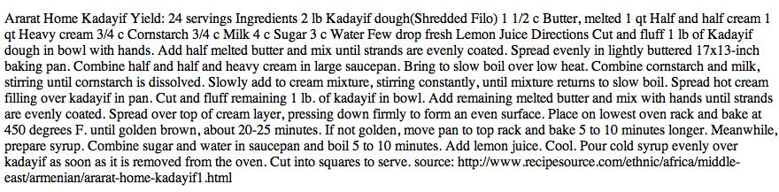
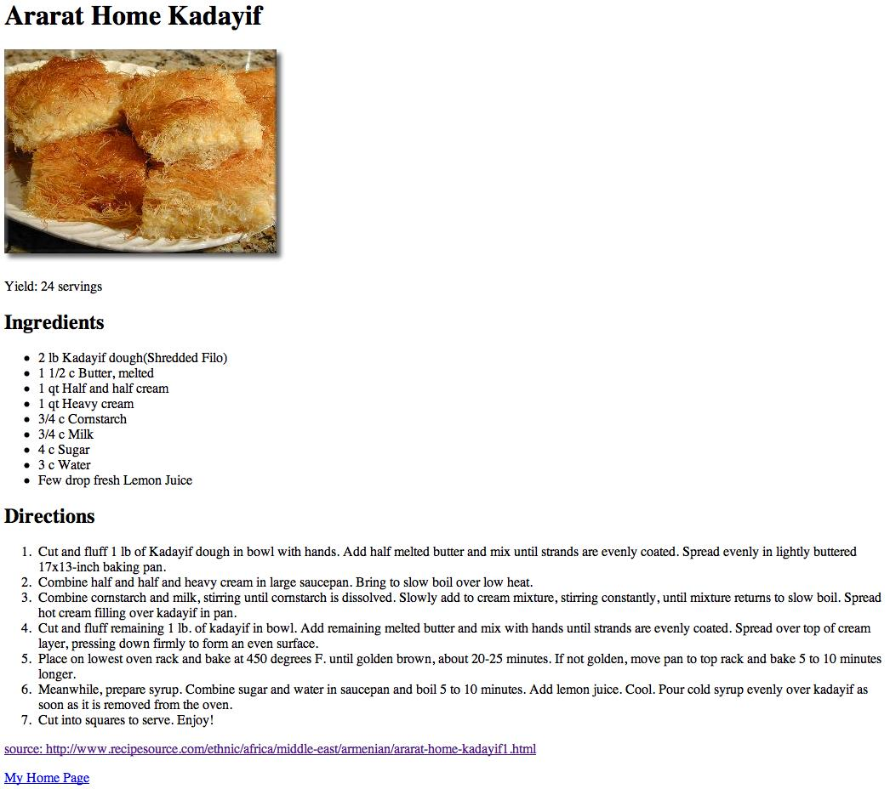
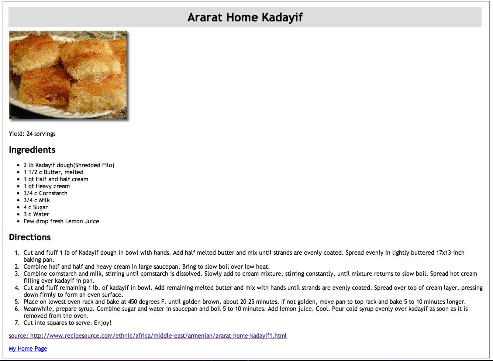
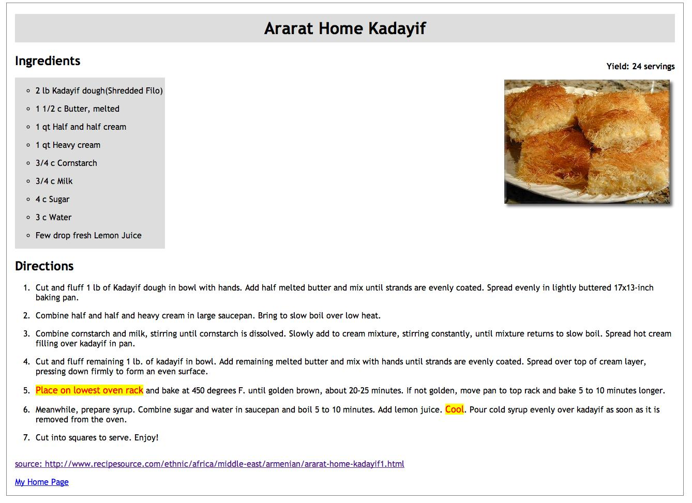

# Legacy Exercise: Basic HTML, CSS, and Validation 

***This exercise was created for a previous iteration of this course when it's number was 230.  You're welcome to try this exercise for practice, but it does not need to be submitted as an assignment.  It is not worth extra bonus points if you complete it.***

## I. Overview & Goals

In this week's exercise, we will be taking a text document, marking it up as an HTML document, improving presentation by adding CSS formatting, validating the code to make sure it's well-written, and uploading it to your RIT web space. 

## II. Setting Up Your Folders and Files

1. On your local drive, (ideally in a previously created **230** folder), create a folder called **exercises**, and within it, create a folder called **recipe**.

2. We have uploaded a file called [kadayif.txt](kadayif.txt) to Github. When you click the link to view that file on Github, you'll see that it's a plain text file into which we've copied content from RecipeSource. Specifically, this [Ararat Home Kadayif recipe](http://www.recipesource.com/ethnic/africa/middle-east/armenian/ararat-home-kadayif1.html).

To download that text file to your computer for editing, right-click on the button in the top right corner of the file that says "Raw," choose "Save link as...", and save the file to the **recipe** folder you just created.

3. You're also going to need to download the image: [kadayif.jpg](kadayif.jpg). For this file, you will see a Download button in the top right corner. Right-click that button, choose "Save link as...", and download it to your **recipe** folder. 

## III. Marking Up a Text File

1. Open the kadayif.txt file in your text editor of choice (ie: Brackets, Notepad++, Visual Studio Code, etc). It currently has no HTML markup at all--you're going to turn it into a proper HTML document, and add some simple CSS rules to make it look a bit more presentable. 

2. Use File->Save As... to save a new copy of the file called recipe.html. Make sure you save it to the **recipe** folder and give it an .html extension--it's the extension that tells your editor to enable its HTML support. 

Notice that there is a foreign character in name of this recipe. The letter i in Kadayıf has no dot. In HTML 4, the default character encoding for files was ISO-8859-1, which doesn't properly display special characters (like smart quotes and diacritical marks). Those characters haved to be escaped out (e.g. &imath; would have to be represented as `&imath;`, &copy; would be represented as `&copy;`, and & would have to be represented as `&amp;`)--if you didn't do that, they didn't display properly in the browser. HTML 5 uses UTF-8 encoding, which allows those special characters to appear properly in your document.

3. First, set up your document within the standard HTML5 "skeleton":

```html
<!DOCTYPE html>
<html lang="en">
<head>
	<meta charset="utf-8">
	<title></title>
</head>
<body>

</body>
</html>
```
Where in the above code does the page content belong?  Re-arrange your file contents to make it so.

### Now we need to mark the text up as HTML. 

4. Take the first line (beginning with 'Armenian' and ending with 'Student') and move it into your `<title>` tags. Replace *Ima Student* with your own full name.

5. Now, go ahead and preview the file in your browser.  You should see something like this:  

Pretty ugly, huh?  Let’s continue.

6. Add an `<h1>` heading to the name of the dish at the top of the page, and `<h2>` headings for the **Ingredients** and **Directions** subsections.

7. Put the text "Yield:  24 Servings" into a `<p>` element. 

8. Make the Ingredients section into a bulleted ("unordered") list, and Directions section into a numbered ("ordered") lists. 

9. Right after the `<h1>` element, add the image, with appropriate alt text. Don't worry about positioning it for now; we'll deal with that when we add the CSS. 

Don't worry about adding links yet; we'll be doing that later. 

10. When you're done, preview your document in browser, again. It should now look something like this: 


## IV. Publishing Your Files
 
1. Once you're satisfied with the HTML file, upload your **exercises** folder (which includes your **recipe** folder and its contents) to your **230** folder on Banjo. 

2. Test it by going to `http://people.rit.edu/yourid/230/exercises/recipe` -- you should see the .txt and .html files, and the image. Click on the html file and make sure it displays properly. 

3. Test this page with the validator.  Do not continue until the page passes validation.

If you run into problems here, **ask for help ASAP**. 

## V. Adding More Structure and Meaning to the Content

First a bit of semantic tagging for our recipe:

1. Edit your Ingredients list so that it has a **class** attribute of "ingredients".
2. Make the URL at the bottom of the page into a hypertext link and wrap it in a `<footer>` element.  It should look like this:

    ```
    <footer>
        <a href = "http://...">source: http://...</a>
    </footer>
    ```
Note:  replace the "..." with the rest of the URL.

3. Add an additional link at the bottom of the page (after the source link and within the footer) that goes to your ([future?](../week-2/230-home-page.md)) home page for this class (http://people.rit.edu/abc1234/230).  Wrap each of these links in `<p>` tags.
4. Preview the page.  It should look like the image below.

5. Test this page with the validator.  Do not continue until the page passes validation.

***At this point in the exercise, we're shifting from material discussed in the first half of the week to material discussed in the 2nd half of the week.  Consult the lecture notes if it's still early in the week and you want to work ahead.***

## VI. Improving the Presentation with CSS Formatting
Now we're going to use CSS to start to make the page look a bit more presentable.  Instead of adding our CSS in the `<head>` tag of the page as an embedded style sheet, this time we will use an external style sheet:

1. Create a new file in the **recipe** folder called **recipe.css**... You can leave it blank for the moment. 

2. Edit the **recipe.html** file one last time for now to add a link to the external stylesheet in the <head> by adding. 
	`<link rel="stylesheet" type="text/css" href="recipe.css">`
	
3. Save the HTML file... We'll try not to make any further changes to it.  This would be a good moment to make sure it validates.  Do not continue further your page validates correctly.
	
Now, let’s add some styles to our Recipe page by editing the external style sheet:
    
4. Inside of the **recipe.css** file you just created, we will add a rule that will change the font for all of the text in the document:

    ```
    body {
        font-family: "trebuchet ms", tahoma, verdana;
    }
    ```
    
Save the .css file and reload the .html page in the browser to make sure a change happened.  If not, go back and double-check things.  Are the two files in the same folder?... If you're looking at the page on people.rit.edu, did you also upload the .css file there?...  Are you sure that the `<link>` line you added to the .html file is correct?... Try clearing your cache or visiting the URL through 'private browsing mode' if your changes don't seem to take effect.

5. Now, add the following declarations to the **body** selector you just created:

    ```
    margin-left: 10%;
    margin-right: 10%;
    border: 1px solid gray;
    ```
    
Test this!  You should now see a border around the text.

6. Did you notice that the text is too close to the border?  Let’s fix that.  Add the following to the body selector:

    ```
    padding-left: 1em;
	padding-right: 1em;
    ```
    
Test it!  There should be more room now.  Notice how the **margin** declarations affect the *outside* of the **body** tag while the **padding** declarations affect the *inside* of the body tag.  These properties work the same way with any of the other container elements (i.e., `<p>`, `<ol>`, `<em>`, etc.)

7. For fun, see if you can change the `<h1>` tag’s background to a light gray.  If you don’t know how to set background colors in CSS, search for it on-line.

8. Now, adjust the padding properties (padding-bottom, padding-top, etc.) of your **h1** rule so the text fits into its "box" a little better.

9. Add the declarations necessary to center the `<h1>` tags text using the **text-align** property.

10. Preview your page.  It should look like the image below.

 
11. Now, try validating the CSS you have used in your page.  You can find the CSS validator at:
http://jigsaw.w3.org/css-validator


## VII. Adding Even More Rules

Now, make the following changes:

1. The items in your lists are tightly "scrunched" together.  Add a CSS rule for the `<li>` tags that will put more space between each item.  Use the following reference and look under the headings **padding** or **margin** for more ideas:
http://www.w3schools.com/css/css_reference.asp

2. Add a gray (or any color other than white) background color to the list of ingredients.  You can use the **ingredients** class selector to accomplish this.  Preview things.

3. What happened?  The background of the `<ul class="ingredients">` entity now stretches to fill the full width of the page.  Fix this by using the **width** property in your style rule.  For now, set it to a fixed width of about 250 pixels.  

4. Then, still modifying the **ingredients** class, set the **list-style-type** property to **circle**, and adjust the **padding** so the list looks a little better.

5. This page would look a lot better if we put the image over on the right side of the page opposite the ingredients list.  We can do this using the **float** property.  We’ll discuss **float** in our next lecture.  For now, just add the following style rule to your page:
	```img { float: right; clear: both;}```
	
6. Add a *class selector* rule named: **.important**.  Set this rule so that text will be rendered in *red, 10% larger* than the default font size, and with a *yellow* background.

7. Use the `<span>` tag to apply this class to the text "Place on lowest oven rack."

8. Now, use another `<span>` tag to apply the same class rule to the text "Cool" near the bottom of the instruction list.

9. Validate your CSS!

Let's go back into the recipe.html to make one last change.  So you can see how it works, we will use an *in-line* style to modify one of our paragraphs.

10. First, move the paragraph saying "Yield: 24 servings" so that it appears before the `` tag.  Then change the tag as follows:
	```<p style="float: right; font-weight: bold">Yield: 24 servings</p>```

11. Your page should now look something like the image below.


Now, while this page probably won't win any design awards, the "look" and accessibility of the content has radically improved!

## VIII:  Put Your Stamp On It
1. Change the background color of the footer text at the bottom of the page to any appropriate color using the **footer** selector. (Continue to modify your external style sheet for these steps)
2. Add **three additional** CSS properties to the page that we have not yet used.  (be prepared to describe what they are in the drop box comment field).

## IX:  Validate Your Page
1. Use the online tools to make sure that your page is well-formed and passes HTML5 validation at http://validator.w3.org 

2. Also validate the CSS! The CSS validator is extremely helpful in debugging wonky CSS:
http://jigsaw.w3.org/css-validator/

## ~~X. Homework Submission~~
~~Complete all steps above and when you're done:~~
1. ~~Zip your **recipe** folder for submission to the dropbox.~~
2. ~~Upload your finished files so that they appear on banjo at the URL mentioned in Section IV. Step 2.  Do not hide your index view, we want to be able to view your .css file easily by clicking to it (adjust your other .htaccess file or add a new one in this directory if necessary to correct).~~
3. ~~If you've already finished [the other Homework](../week-2/230-home-page.md), link to the remote **recipe.html** page from your 230 Homepage.~~
3. ~~Check the dropbox for other details.~~

