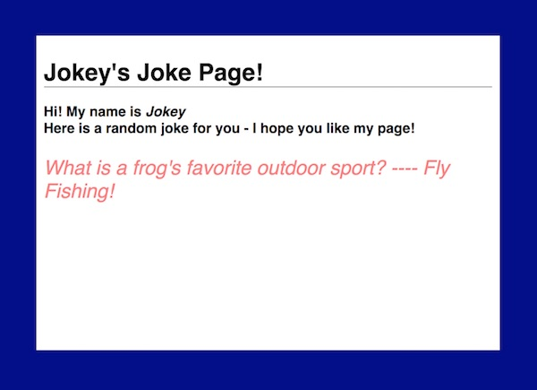
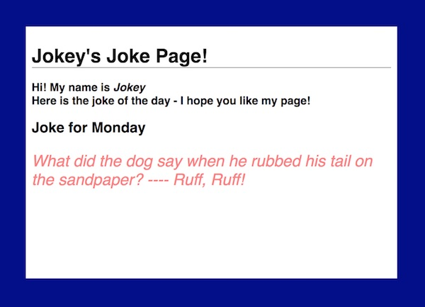
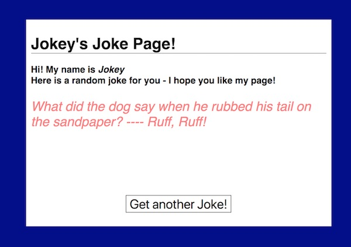

# Homework - PHP: "Fact Of The Day" page

## I. Overview
In this assignment you will create:
- a PHP-driven "random fact" page
- and a PHP-driven "fact of the day" page

To do this assignment, you should have completed at least the [3rd PHP Tutorial - Arrays](php-3.md)

Here are screen shots of the completed examples:

### PHP "Random Facts" Page


### PHP "Fact of the Day" Page (on any Monday)


### PHP "Fact of the Day" Page (on any Tuesday)


## II. Instructions
**HW-random-fact.php**
1. The outputted page will be valid HTML5.
1. You must spend some time designing the page, and have at least 3 CSS rules.
1. Your design should look no worse than the minimal example above, and ideally better! Above, I set (in CSS) the `width` and `height` of the main &lt;div> to 600 x 400, and used `margin-left:auto;` and `margin-right:auto;` to center it.
1. Create an array of at least 7 "facts". The example uses jokes, but the facts could be a random quote, vocabulary word, trivia, a Magic 8-ball type fortune, or whatever.
1. Pull a random fact out of the array every time the page is loaded or re-loaded, and display it. There are a couple of ways to do this - you can look here: http://php.net/manual/en/ref.array.php and here: http://php.net/manual/en/function.rand.php
1. See below -  **III. Adding a submit button to *HW-random-fact.php*** 
1. **Submission:** When you are done, post the page to `banjo.rit.edu`, zip and post your file to the appropriate dropbox, and put the link in the dropbox comments field.

**HW-fact-of-the-day.php**
1. The requirements are the same as above, except that you will display a different fact depending on what day of the week it is. If it is Sunday, then the same fact will be shown for the whole day; if it is Monday, then another fact will be shown for the whole day, and so on.
1. You will also display to the user what day of the week it is (DO NOT display other time or date information other than the *name* of the current day of the week)
1. There are a number of way to get this "what day is it?" information, however the best for our purposes is:
    - `date()` - http://php.net/manual/en/function.date.php (refer to the official php site to look up how to format the output... hint: it's in the *Day* section)
1. **Submission:** When you are done, post the page to `banjo.rit.edu`, zip and post your file to the appropriate dropbox, and put the link in the dropbox comments field.

# III. Adding a submit button to *HW-random-fact.php*
Rather than the user having to manually reload the page to see a new joke, let's give the user a button to do so.
- Because this is a server-side script, we are going to need an HTML &lt;form> tag to trigger a page reload.
- the `action` of the form is the page it should call when it is submitted, in this case the value of `action` is the current page.
- the `method` of the page really only matters when we are passing data with the form submission (which we are not). The `post` method sends data to to server as a separate file, the `get` method sends the data encoded on the URL as a query string. Here we will use `post` so that we keep our URL "clean".


**Here is the HTML you will need:**

```
<form action="HW-random-fact.php" method="post">
	<input type="submit" value="Get another Joke!">
</form>
```

**Make sure that your final version of *HW-random-fact.php* has this button. When the user clicks this button the page will be reloaded and they will see a new random fact. You will probably also want to use CSS to style it up a little - see the example below:**



<hr><hr>

**[Table of Contents <- About this PHP Tutorial Series](php-0.md)**
