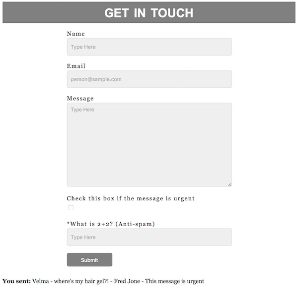

# Homework - PHP: Mail Form addition

## To Do:
1. duplicate the contents of *php-mail-3.php* and name it **php-mail-HW.php**
2. add another field to the form:
    - it could be another text field for last name, ZIP code, or other information for example
    - or you could use another type of form element like a check box or radio button or a password field, that is up to you:
        - https://www.w3schools.com/html/html_form_elements.asp
        - https://www.w3schools.com/html/html_form_input_types.asp
3. be sure that the contents of the new form field are incorporated into the email, and on the bottom of the page after the submit button is clicked!
4. see the mycourses dropbox for due date

### Examples of completed homework

**Below we added a checkbox, and incorporated the results into the email:**

**And here is another example:**

	
