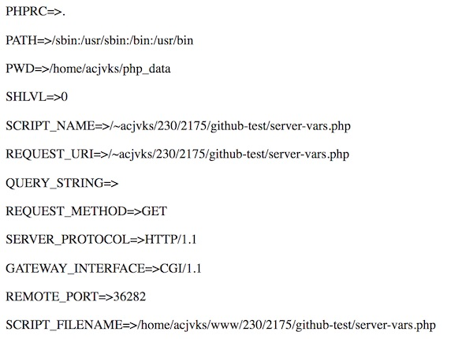
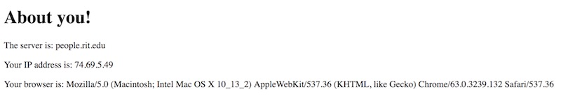
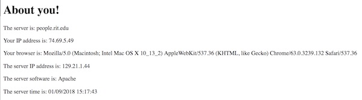

# 3 - PHP Arrays

## Contents
<!--- Local Navigation --->
I. [Overview](#section1)

II. [Creating indexed arrays](#section2)

III. [Looping though arrays](#section3)

IV. [Array functions](#section4)

V. [Associative arrays](#section5)

VI. [The `$_SERVER` "super global"](#section6)

VII. [Review Exercise](#section7)

<hr><hr>

## I. <a id="section1">Overview
	
An [array](http://php.net/manual/en/language.types.array.php) in PHP is actually an ordered *map*. A map is a type that associates *values* to *keys*. This type is optimized for several different uses, and in this course we will treat it both as an (indexed) array, and a dictionary.
  
## II. <a id="section2">Creating indexed arrays

**php-arrays-1.php**
```php
<?PHP
 	// 1 - Indexed arrays - there are two ways to initialize one
 	
 	// A - the array() function will create an array
 	$schools = array("RIT","RPI","MCC");
 	
 	// B - specify an array literal
 	$colors = ["red","green","blue"];
 	
 	// 2 - access elements with []
 	echo "<p>First \$school is " .  $schools[0] . "</p>";
 	
 	// curly braces around the array let us use string interpolation
 	echo "<p>Second \$color is {$colors[1]}</p>";
 	
 	// 3 - to debug your arrays, use one of these functions
 	
 	echo "<pre>";
 	var_dump($schools);
 	echo "</pre>";
 	
 	echo "<pre>";
 	print_r($colors);
 	echo "</pre>";
	
	// 4 - PHP arrays can contain any type of value
 	$stuff = ["One", 2, 2.5, true, [9,8,7,6]];
 	echo "<pre>";
 	print_r($stuff);
 	echo "</pre>";
?>
```

## III. <a id="section3">Looping through arrays
You can loop though arrays as follows:

 **php-arrays-2.php**
```php
<?PHP
	$colors = ["red","green","blue"];
	
	// 1 - loop through arrays with classic for loop
	echo "<h2>for loop</h2>";
	for($i=0;$i<count($colors);$i++){
		$value = $colors[$i];
 		echo "<p>$value</p>";
 	}

 	// 2 - loop through arrays with foreach (EASIER!)
 	echo "<h2>foreach loop</h2>";
 	foreach($colors as $value){
 		echo "<p>$value</p>";
 	}
 	
 	
 	// 3 - you can grab both the key (index) and the value like this
 	echo "<h2>foreach loop with key and value</h2>";
 	foreach($colors as $key => $value){
 		echo "<p>$key=$value</p>";
 	}
?>
```


## IV. <a id="section4">Array functions
Arrays in PHP are not objects like you see in many other languages, but are instead what PHP calls *resources*. 
- In many languages we might access the length of an array through a property like this `myArray.length`
- But in PHP, we instead use a pre-defined function, and pass in the array as an argument like this `count($myArray)`

 **php-arrays-3.php**
 ```php
<?PHP
	$colors = ["red","green","blue"];
 	$length =  count($colors);
 	echo "<p>The length of \$colors is $length</p>";
?>
 ```
 
 
 Other operations you can do include sorting arrays:
 
  **php-arrays-4.php**
 ```php
 <?PHP
	$colors = ["red","green","blue"];
	
	// sort ascending
 	sort($colors,SORT_STRING);
 	echo "<pre>";
 	print_r($colors);
 	echo "</pre>";
 	
 	// sort descending
 	rsort($colors,SORT_STRING);
 	echo "<pre>";
 	print_r($colors);
 	echo "</pre>";

?>
 ```
 
  And adding and removing elements from an arrays:
  
  **php-arrays-5.php**
 ```php
 <?PHP
	$colors = ["red","green","blue"];
	
	// remove elements
	array_pop($colors); // remove last element
	array_shift($colors); // remove first element
 	echo "<pre>";
 	print_r($colors);
 	echo "</pre>";
 	
 	// add elements
	array_push($colors,"magenta"); // add to end
	array_unshift($colors,"teal"); // at to beginning
 	echo "<pre>";
 	print_r($colors);
 	echo "</pre>";
?>
 ```
 Note: push, pop, shift, and unshift work the same in JavaScript and [this handy mnemonic](https://simplestepscode.com/array-push-pop-shift-unshift/) can help you keep them straight.
 
 There are many more functions that operate on arrays - you can find a full list here: 
 - http://php.net/manual/en/ref.array.php
 
 ## V. <a id="section5">Associative Arrays

So far our PHP arrays have used numeric (integer) indexes to reference values, but they can also use strings as keys. When we use string for keys, what we have is called an *Associative Array*.

 **php-arrays-6.php**
 ```php
 <?PHP
	$links = ["RIT"=>"http://www.rit.edu",
		"RPI"=>"http://www.rpi.edu",
		"MCC"=>"http://www.monroecc.edu"];
	
	// 1 - access elements by key 
	$url = $links["RIT"];
	echo "<p>$url</p>";
	
	// 2 - add new elements by specifying a key:value
	$links["Brockport"]="https://www.brockport.edu";
	
	// 3 - loop through arrays with longer version of foreach loop
	foreach($links as $key=>$value){
		echo "<p>$key => $value</p>";
	}
?>
```
	
 ## VI. <a id="section6">The `$_SERVER` "super global"
 
- PHP has a number of "Super Global" associate arrays that are always available in all scopes : http://php.net/manual/en/reserved.variables.server.php
 - The `$_SERVER` super global contains "Server and execution environment information" such as paths and script locations, and this information is provided by the web server : http://php.net/manual/en/reserved.variables.server.php
 
More interestingly, this variable also contains information about the user including their IP address, the "User Agent" (i.e. browser) that requested the page, and the page's "referrer" - if they clicked on a link that sent them to your page.

The following script will loop through the `$_SERVER` array and print out all of the keys and values:

**php-arrays-7.php**

```php
<?php

foreach($_SERVER as $key=>$value){
	echo "<p>$key=>$value</p>";
}

?>
```

Which looks like this:




We can also get solely the information we are interested in by specifying a **key**:

**php-arrays-8.php**
```php
<!DOCTYPE html>
<html lang="en">
<head>
	<meta charset="utf-8" />
	<title>About you!</title>
</head>
<body>
<h1>About you!</h1>
<?PHP
	$server =  $_SERVER["SERVER_NAME"];
	$ip =  $_SERVER["REMOTE_ADDR"];
	$ua =  $_SERVER["HTTP_USER_AGENT"];
	echo "<p>The server is: $server</p>";
	echo "<p>Your IP address is: $ip</p>";
	echo "<p>Your browser is: $ua</p>";
?>
</body>
</html>
```

Which looks like this:




 
 ## VII. <a id="section7">Review Exercise

### VII-A. Associative Array Practice
Create a page named **php-3A-HW.php** that does the following:
1. Loops through this array - `$colors = ["red","green","blue"];` - and creates an HTML *ordered list* (the &lt;ol> and &lt;li> tags) that displays the contents of the array.
2. Loops through the `$links` associative array in *php-arrays-6.php* - and uses the key and value to create an HTML *unordered list* of clickable hypertext links.
3. It is suggested (but not required) that you write your code in such a way that only one `echo` statement is required.

The HTML page will look something like this when you are done:


### VII-B. `$_SERVER` Practice
Duplicate *php-arrays-8.php*,  rename it to **php-3B-HW.php** and:
- add 3 more echo statements that include information on the server's IP address, the server software, and the server "request time".        
- format the server time to be human readable by using PHP's date function:  http://php.net/manual/en/function.date.php

When you are done, it will look something like this:




**Can you see of how this information about our page vistors is useful? Soon we will learn how to log this data (IP address and user agent) to a file.**

**If you have not yet completed the [PHP: "Fact Of The Day" HW](HW-php-fact-of-the-day.md) - you should do so now. Check the mycourses dropbox for the due date.**

<hr><hr>


| <-- Previous Unit | Home | Next Unit -->
| --- | --- | --- 
|   **[PHP Scalars & Data Types (chapter 2)](php-2.md)**  |  **[About this PHP Tutorial Series](php-0.md)** | **[PHP Mail & Forms (chapter 4)](php-4.md)**
