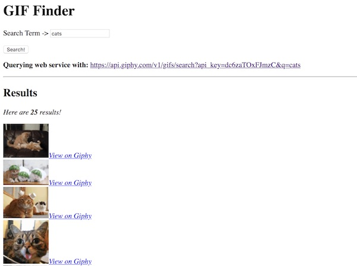
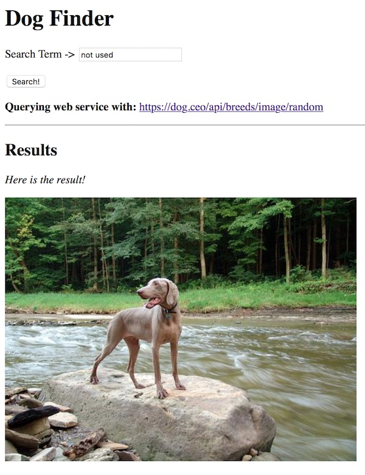
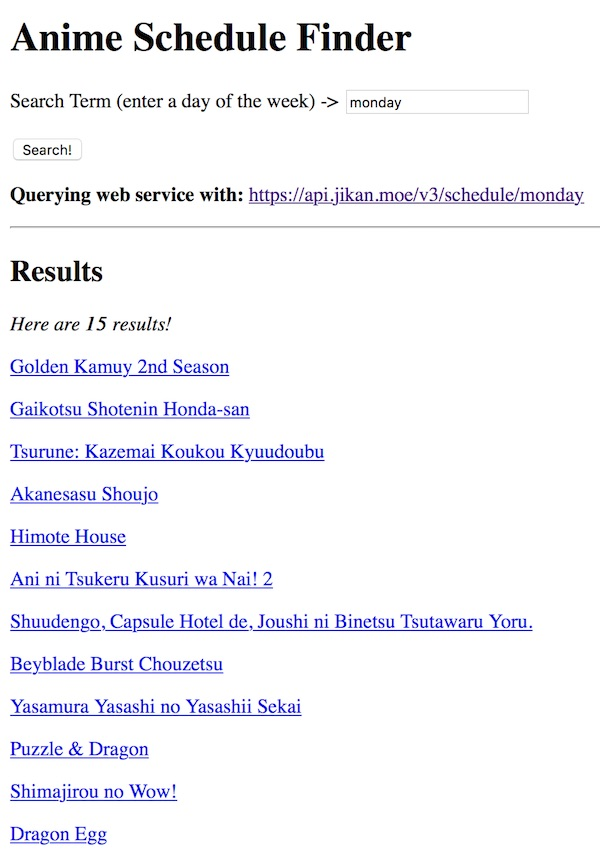
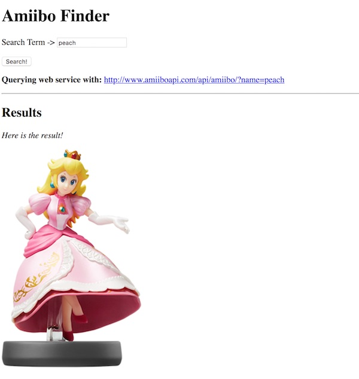

# Web Service App - Examples & Starters 

- Below is fully functional web service "starter" code for several APIs
- We have provide 2 examples for each API. One of the examples uses [`jQuery.ajax()`](https://api.jquery.com/jQuery.Ajax/#jQuery-ajax-url-settings), the other uses the browser native [`XMLHttpRequest`](https://developer.mozilla.org/en-US/docs/Web/API/XMLHttpRequest) (aka XHR) object
- These were working as of 11/1/2020
- For some of these, you may need to apply for your own API key

## Contents
<!--- Local Navigation --->
I. [GIPHY API](#giphy)

II. [Dog API](#random-dog)

III. [Anime Schedule Finder API](#anime-schedule-finder)

IV. [Amiibo API](#amiibo)

<hr><hr>

<a id="giphy"></a>

## I. GIPHY API

- The GIPHY API docs can be found here: https://developers.giphy.com/docs/
- we have a more complete example of working with the GIPHY API here: [HW-gif-finder.md](./HW-gif-finder.md)

**giphy-xhr.html (recommended method for IGME 235)**

```html
<!DOCTYPE html>
<html lang="en">
<head>
	<meta charset="utf-8" />
 	<title>GIF Finder</title>
 	<style>/* We have no style! */</style>
  <script>
  "use strict";
  
	window.onload = init;
	
	function init(){
		document.querySelector("#search").onclick = getData;
	}
	
	function getData(){
		// 1 - main entry point to web service
		const SERVICE_URL = "https://api.giphy.com/v1/gifs/search?";
		
		// Public API key from here: https://developers.giphy.com/docs/
    		const API_KEY = "5PuWjWVnwpHUQPZK866vd7wQ2qeCeqg7";  // if this doesn't work, get your own key, it's free!
		
		// 2 - build up our URL string
		let url = SERVICE_URL;
		url += "api_key=" + API_KEY;
		
		// 3 - parse the user entered term we wish to search
		let term = document.querySelector("#searchterm").value;
		
		// get rid of any leading and trailing spaces
		term = term.trim();
		// encode spaces and special characters
		term = encodeURIComponent(term);
		
		// if there's no term to search then bail out of the function (return does this)
		if(term.length < 1){
			document.querySelector("#debug").innerHTML = "<b>Enter a search term first!</b>";
			return;
		}
		url += "&q=" + term;
		
		// 4 - update the UI
		document.querySelector("#debug").innerHTML = `<b>Querying web service with:</b> <a href="${url}" target="_blank">${url}</a>`;

		// 5 - create a new XHR object
		let xhr = new XMLHttpRequest();

		// 6 - set the onload handler
		xhr.onload = dataLoaded;
	
		// 7 - set the onerror handler
		xhr.onerror = dataError;

		// 8 - open connection and send the request
		xhr.open("GET",url);
	
		// 8.5 - If you need to set extra headers for the API, set them here
		//xhr.setRequestHeader('origin', 'x-requested-with');

		xhr.send();
		
	}
	
	function dataError(e){
		console.log("An error occurred");
	}
	
	function dataLoaded(e){
		// 1 - e.target is the xhr object
		let xhr = e.target;
	
		// 2 - xhr.responseText is the JSON file we just downloaded
		console.log(xhr.responseText);
	
		// 3 - turn the text into a parsable JavaScript object
		let obj = JSON.parse(xhr.responseText);
	
		// 4 - if there are no results, print a message and return
		if(!obj.data || obj.data.length == 0){
			document.querySelector("#content").innerHTML = "<p><i>No results found!</p>";
			return; // Bail out
		}
		
		// 5 - if there is an array of results, loop through them
		let results = obj.data
		let bigString = `<p><i>Here are <b>${results.length}</b> results!</i></p>`; // ES6 String Templating
		
		for (let i=0;i<results.length;i++){
			let result = results[i];
			let url = result.url;
			let smallURL = result.images.fixed_width_small.url;
			if (!smallURL) smallURL = "images/no-image-found.png";
			let line = `<div class='result'>`;
			line += ``;
      			line += `<span><a target='_blank' href='${url}'>View on Giphy</a></span>`;
      			line += `</div>`;
			bigString += line;
		}
		
		// 6 - display final results to user
		document.querySelector("#content").innerHTML = bigString;
	}	
	
  </script>

</head>
<body>
  <header>
    <h1>GIF Finder</h1>
  </header>

  <p>Search Term -&gt; <input id="searchterm" type="text" size="20" maxlength="20" autofocus value="cats" /></p>
  <p><button type="button" id="search" class="green">Search!</button></p>
  <p id="debug"></p>
  <hr>
  <h2>Results</h2>
  <div id="content">
    <p>No data yet!</p>
  </div>
</body>
</html>
```

**giphy-jquery-ajax.html**

```html
<!DOCTYPE html>
<html lang="en">
<head>
	<meta charset="utf-8" />
 	<title>GIF Finder</title>
 	<style>/* We have no style! */</style>
	<!-- Import jQuery -->
  <script src="https://ajax.googleapis.com/ajax/libs/jquery/1.10.2/jquery.min.js"></script>
  <script>
  	"use strict";
	window.onload = init;
	
	function init(){
		document.querySelector("#search").onclick = getData;
	}
	
	function getData(){
		// 1 - main entry point to web service
		const SERVICE_URL = "https://api.giphy.com/v1/gifs/search?";
		
		// Public API key from here: https://developers.giphy.com/docs/
    		const API_KEY = "5PuWjWVnwpHUQPZK866vd7wQ2qeCeqg7";  // if this doesn't work, get your own key, it's free!
		
		// 2 - build up our URL string
		let url = SERVICE_URL;
		url += "api_key=" + API_KEY;
		
		// 3 - parse the user entered term we wish to search
		let term = document.querySelector("#searchterm").value;
		
		// get rid of any leading and trailing spaces
		term = term.trim();
		// encode spaces and special characters
		term = encodeURIComponent(term);
		
		// if there's no term to search then bail out of the function (return does this)
		if(term.length < 1){
			document.querySelector("#debug").innerHTML = "<b>Enter a search term first!</b>";
			return;
		}
		url += "&q=" + term;
		
		// 4 - update the UI
		document.querySelector("#debug").innerHTML = `<b>Querying web service with:</b> <a href="${url}" target="_blank">${url}</a>`;
		
		// 5 - call the web service, and prepare to download the file
		$.ajax({
		  dataType: "json",
		  url: url,
		  //headers: { 'x-my-custom-header': 'some value' },
		  data: null,
		  success: jsonLoaded
		});
		
		
	}
	
	
	function jsonLoaded(obj){
		// 6 - if there are no results, print a message and return
		if(!obj.data || obj.data.length == 0){
			document.querySelector("#content").innerHTML = "<p><i>No results found!</p>";
			return; // Bail out
		}
		
		// 7 - if there is an array of results, loop through them
		let results = obj.data
	let bigString = `<p><i>Here are <b>${results.length}</b> results!</i></p>`; // ES6 String Templating
		
		for (let i=0;i<results.length;i++){
			let result = results[i];
			let url = result.url;
			let smallURL = result.images.fixed_width_small.url;
			if (!smallURL) smallURL = "images/no-image-found.png";
			let line = `<div class='result'>`;
      			line += `<span><a target='_blank' href='${url}'>View on Giphy</a></span></div>`;
			bigString += line;
		}
		
		// 8 - display final results to user
		document.querySelector("#content").innerHTML = bigString;
	}	
	
  </script>

</head>
<body>
  <header>
    <h1>GIF Finder</h1>
  </header>

  <p>Search Term -&gt; <input id="searchterm" type="text" size="20" maxlength="20" autofocus value="cats" /></p>
  <p><button type="button" id="search" class="green">Search!</button></p>
  <p id="debug"></p>
  <hr>
  <h2>Results</h2>
  <div id="content">
    <p>No data yet!</p>
  </div>
</body>
</html>
```

**Screenshot:**



<hr>

<a id="random-dog"></a>

## II. Dog API

- The Dog API docs can be found here: https://dog.ceo/dog-api/documentation/
- This API does not currently require an API key
- This API has multiple endpoints. The one we are using here just returns a single picture of a random dog. 
- If you are going to use this API with a project, you will need to use a different endpoint because this one doesn't do very much
- Suggestions:
  - You can use the "By Breed" endpoint which returns an array of images. You will use this in conjunction with a pulldown that has a list of all of the available breeds.

**dog-xhr.html (recommended method for IGME 235)**

```html
<!DOCTYPE html>
<html lang="en">
<head>
	<meta charset="utf-8" />
 	<title>Dog Finder</title>
 	<style>/* We have no style! */</style>

  <script>
  "use strict";
	window.onload = init;
	
	function init(){
		document.querySelector("#search").onclick = getData;
	}
	
	function getData(){
		// 1 - main entry point to web service
		const SERVICE_URL = "https://dog.ceo/api/breeds/image/random";
		
		// No API Key required!
		
		// 2 - build up our URL string
		// not necessary for this service endpoint
		let url = SERVICE_URL;
		
		// 3 - parse the user entered term we wish to search
		// not necessary for this service endpoint
		
		// 4 - update the UI
		document.querySelector("#debug").innerHTML = `<b>Querying web service with:</b> <a href="${url}" target="_blank">${url}</a>`;
		
		// 5 - create a new XHR object
		let xhr = new XMLHttpRequest();

		// 6 - set the onload handler
		xhr.onload = dataLoaded;
	
		// 7 - set the onerror handler
		xhr.onerror = dataError;

		// 8 - open connection and send the request
		xhr.open("GET",url);
		xhr.send();
	}
	
	function dataError(e){
		console.log("An error occurred");
	}
	
	function dataLoaded(e){
		// 1 - e.target is the xhr object
		let xhr = e.target;
	
		// 2 - xhr.responseText is the JSON file we just downloaded
		console.log(xhr.responseText);
	
		// 3 - turn the text into a parsable JavaScript object
		let obj = JSON.parse(xhr.responseText);
		
		// 4 - if there are no results, print a message and return
		// Here, we don't get an array back, but instead a single object literal with 2 properties
		if(obj.status != "success"){
			document.querySelector("#content").innerHTML = "<p><i>There was a problem!</i></p>";
			return; // Bail out
		}
		
		// 5 - if there is an array of results, loop through them
		let results = obj.data
		let bigString = "<p><i>Here is the result!</i></p>";
		let src = obj.message;
		
		bigString += ``
		
		// 6 - display final results to user
		document.querySelector("#content").innerHTML = bigString;
	}	
	
  </script>

</head>
<body>
<header>
 <h1>Dog Finder</h1>
</header>

<p>Search Term -&gt; <input id="searchterm" type="text" size="20" maxlength="20" autofocus value="not used" /></p>
<p><button type="button" id="search" class="green">Search!</button></p>
<p id="debug"></p>
<hr>
<h2>Results</h2>
 <div id="content">
 <p>No data yet!</p>
 </div>
 
</body>
</html>
```

**dog-jquery-ajax.html**

```html
<!DOCTYPE html>
<html lang="en">
<head>
	<meta charset="utf-8" />
 	<title>Dog Finder</title>
 	<style>/* We have no style! */</style>
	<!-- Import jQuery -->
  <script src="https://ajax.googleapis.com/ajax/libs/jquery/1.10.2/jquery.min.js"></script>
  <script>
  	"use strict";
	window.onload = init;
	
	function init(){
		document.querySelector("#search").onclick = getData;
	}
	
	function getData(){
		// 1 - main entry point to web service
		const SERVICE_URL = "https://dog.ceo/api/breeds/image/random";
		
		// No API Key required!
		
		// 2 - build up our URL string
		// not necessary for this service endpoint
		let url = SERVICE_URL;
		
		// 3 - parse the user entered term we wish to search
		// not necessary for this service endpoint
		
		// 4 - update the UI
		document.querySelector("#debug").innerHTML = `<b>Querying web service with:</b> <a href="${url}" target="_blank">${url}</a>`;
		
		// 5- call the web service, and prepare to download the file
		$.ajax({
		  dataType: "json",
		  url: url,
		  data: null,
		  success: jsonLoaded
		});
		
		
	}
	
	
	function jsonLoaded(obj){
		// 6 - if there are no results, print a message and return
		// Here, we don't get an array back, but instead a single object literal with 2 properties
		
		if(obj.status != "success"){
			document.querySelector("#content").innerHTML = "<p><i>There was a problem!</i></p>";
			return; // Bail out
		}
		
		// 7 - if there is an array of results, loop through them
		let results = obj.data
		let bigString = "<p><i>Here is the result!</i></p>";
		let src = obj.message;
		
		bigString += ``
		
		// 8 - display final results to user
		document.querySelector("#content").innerHTML = bigString;
	}	
	
  </script>

</head>
<body>
<header>
 <h1>Dog Finder</h1>
</header>

<p>Search Term -&gt; <input id="searchterm" type="text" size="20" maxlength="20" autofocus value="not used" /></p>
<p><button type="button" id="search" class="green">Search!</button></p>
<p id="debug"></p>
<hr>
<h2>Results</h2>
 <div id="content">
 <p>No data yet!</p>
 </div>
 
</body>
</html>
```

**Screenshot:**



<hr>


<a id="anime-schedule-finder"></a>

## III. Anime Schedule Finder API
- The *Jikan Unofficial MyAnimeList API* docs can be found here: https://jikan.docs.apiary.io/
- This API does not currently require an API key
- This API has a lot of endpoints!
- Challenges - add code that:
  - shows an image for each anime
  - shows the synopsis for each anime
  - shows the genres for each anime
- PS: making the user type in the day of the week is horrible, awful usability. If you end up using this endpoint, be sure to have the days of the week pre-populated in a pulldown!

**anime-schedule-xhr.html (recommended method for IGME 235)**

```html
<!DOCTYPE html>
<html lang="en">
<head>
	<meta charset="utf-8" />
 	<title>Anime Schedule Finder</title>
 	<style>/* We have no style! */</style>
  <script>
  "use strict";
	window.onload = init;
	
	function init(){
		document.querySelector("#search").onclick = getData;
	}
	
	let term = ""; // we declared `term` out here because we will need it later
	function getData(){
		// 1 - main entry point to web service
		const SERVICE_URL = "https://api.jikan.moe/v3/schedule/";
		
		// No API Key required!
		
		// 2 - build up our URL string
		let url = SERVICE_URL;
		
		// 3 - parse the user entered term we wish to search
		term = document.querySelector("#searchterm").value;
		
		// get rid of any leading and trailing spaces
		term = term.trim();
		// encode spaces and special characters
		term = encodeURIComponent(term);
		
		// if there's no term to search then bail out of the function (return does this)
		if(term.length < 1){
			document.querySelector("#debug").innerHTML = "<b>Enter a search term first!</b>";
			return;
		}
		url += term;
		
		// 4 - update the UI
		document.querySelector("#debug").innerHTML = `<b>Querying web service with:</b> <a href="${url}" target="_blank">${url}</a>`;
		
		// 5 - create a new XHR object
		let xhr = new XMLHttpRequest();

		// 6 - set the onload handler
		xhr.onload = dataLoaded;
	
		// 7 - set the onerror handler
		xhr.onerror = dataError;

		// 8 - open connection and send the request
		xhr.open("GET",url);
		xhr.send();
	}
	
	function dataError(e){
		console.log("An error occurred");
	}
	
	function dataLoaded(e){
		// 1 - e.target is the xhr object
		let xhr = e.target;
	
		// 2 - xhr.responseText is the JSON file we just downloaded
		console.log(xhr.responseText);
	
		// 3 - turn the text into a parsable JavaScript object
		let obj = JSON.parse(xhr.responseText);
		
		// 4 - if there are no results, print a message and return
		if(obj.error){
			let msg = obj.error;
			document.querySelector("#content").innerHTML = `<p><i>Problem! <b>${msg}</b></i></p>`;
			return; // Bail out
		}
		
		// 5 - if there is an array of results, loop through them
		// this is a weird API, the name of the key is the day of the week you asked for
		let results = obj[term];
		if(!results){
			document.querySelector("#content").innerHTML = `<p><i>Problem! <b>No results for "${term}"</b></i></p>`;
			return;
		}
		
		// 6 - put together HTML
		let bigString = `<p><i>Here are <b>${results.length}</b> results!</i></p>`; // ES6 String Templating
		
		for (let i=0;i<results.length;i++){
			let result = results[i];
			let url = result.url;
			let title = result.title;
			let line = `<p class='result'><a href='${url}'>${title}</a></p>`;
			bigString += line;
		}
		
		// 7 - display final results to user
		document.querySelector("#content").innerHTML = bigString;
	}	
	
  </script>

</head>
<body>
<header>
 <h1>Anime Schedule Finder</h1>
</header>

<p>Search Term (enter a day of the week) -&gt; <input id="searchterm" type="text" size="20" maxlength="20" autofocus value="monday" /></p>
<p><button type="button" id="search" class="green">Search!</button></p>
<p id="debug"></p>
<hr>
<h2>Results</h2>
 <div id="content">
 <p>No data yet!</p>
 </div>
 
</body>
</html>
```

**anime-schedule-jquery-ajax.html**

```html
<!DOCTYPE html>
<html lang="en">
<head>
	<meta charset="utf-8" />
 	<title>Anime Schedule Finder</title>
 	<style>/* We have no style! */</style>
	<!-- Import jQuery -->
  <script src="https://ajax.googleapis.com/ajax/libs/jquery/1.10.2/jquery.min.js"></script>
  <script>
  	"use strict";
	window.onload = init;
	
	function init(){
		document.querySelector("#search").onclick = getData;
	}
	
	let term = ""; // we declared `term` out here because we will need it later
	function getData(){
		// 1 - main entry point to web service
		const SERVICE_URL = "https://api.jikan.moe/v3/schedule/";
		
		// No API Key required!
		
		// 2 - build up our URL string
		let url = SERVICE_URL;
		
		// 3 - parse the user entered term we wish to search
		term = document.querySelector("#searchterm").value;
		
		// get rid of any leading and trailing spaces
		term = term.trim();
		// encode spaces and special characters
		term = encodeURIComponent(term);
		
		// if there's no term to search then bail out of the function (return does this)
		if(term.length < 1){
			document.querySelector("#debug").innerHTML = "<b>Enter a search term first!</b>";
			return;
		}
		url += term;
		
		// 4 - update the UI
		document.querySelector("#debug").innerHTML = `<b>Querying web service with:</b> <a href="${url}" target="_blank">${url}</a>`;
		
		// 5- call the web service, and prepare to download the file
		$.ajax({
		  dataType: "json",
		  url: url,
		  data: null,
		  success: jsonLoaded
		});
		
		
	}
	
	
	function jsonLoaded(obj){
		// 6 - if there are no results, print a message and return
		if(obj.error){
			let msg = obj.error;
			document.querySelector("#content").innerHTML = `<p><i>Problem! <b>${msg}</b></i></p>`;
			return; // Bail out
		}
		
		// 7 - if there is an array of results, loop through them
		// this is a weird API, the name of the key is the day of the week you asked for
		let results = obj[term];
		if(!results){
			document.querySelector("#content").innerHTML = `<p><i>Problem! <b>No results for "${term}"</b></i></p>`;
			return;
		}
		
		
		let bigString = `<p><i>Here are <b>${results.length}</b> results!</i></p>`; // ES6 String Templating
		
		for (let i=0;i<results.length;i++){
			let result = results[i];
			let url = result.url;
			let title = result.title;
			let line = `<p class='result'><a href='${url}'>${title}</a></p>`;
			bigString += line;
		}
		
		// 8 - display final results to user
		document.querySelector("#content").innerHTML = bigString;
	}	
	
  </script>

</head>
<body>
<header>
 <h1>Anime Schedule Finder</h1>
</header>

<p>Search Term (enter a day of the week) -&gt; <input id="searchterm" type="text" size="20" maxlength="20" autofocus value="monday" /></p>
<p><button type="button" id="search" class="green">Search!</button></p>
<p id="debug"></p>
<hr>
<h2>Results</h2>
 <div id="content">
 <p>No data yet!</p>
 </div>
 

</body>
</html>
```

**Screenshot:**



<hr>

<a id="amiibo"></a>

## IV. Amiibo API

- The Amiibo API can be found here: http://www.amiiboapi.com
- This API does not currently require an API key

**amiibo-xhr.html (recommended method for IGME 235)**

```html
<!DOCTYPE html>
<html lang="en">
<head>
	<meta charset="utf-8" />
 	<title>Amiibo Finder</title>
 	<style>/* We have no style! */</style>
  <script>
  "use strict";
	window.onload = init;
	
	function init(){
		document.querySelector("#search").onclick = getData;
	}
	
	function getData(){
		// 1 - main entry point to web service
		const SERVICE_URL = "https://www.amiiboapi.com/api/amiibo/?name=";
		
		// No API Key required!
		
		// 2 - build up our URL string
		// not necessary for this service endpoint
		let url = SERVICE_URL;
		
		// 3 - parse the user entered term we wish to search
		// not necessary for this service endpoint
		let term = document.querySelector("#searchterm").value.trim();
		term = encodeURIComponent(term);
		url+=term;
		
		// 4 - update the UI
		document.querySelector("#debug").innerHTML = `<b>Querying web service with:</b> <a href="${url}" target="_blank">${url}</a>`;
		
		// 5 - create a new XHR object
		let xhr = new XMLHttpRequest();
	

		// 6 - set the onload handler
		xhr.onload = dataLoaded;
	
		// 7 - set the onerror handler
		xhr.onerror = dataError;

		// 8 - open connection and send the request
		xhr.open("GET",url);
		xhr.send();
	}
	
	function dataError(e){
		console.log("An error occurred");
	}
	
	function dataLoaded(e){
		// 1 - e.target is the xhr object
		let xhr = e.target;
	
		// 2 - xhr.responseText is the JSON file we just downloaded
		console.log(xhr.responseText);
	
		// 3 - turn the text into a parsable JavaScript object
		let obj = JSON.parse(xhr.responseText);
		
		// 4 - if there is an array of results, loop through them
		let results = obj.amiibo;
		let firstResult = results[0];
		let bigString = "<p><i>Here is the first result!</i></p>";
		bigString += ``;

		// 5 - display final results to user
		document.querySelector("#content").innerHTML = bigString;
	}	
	
  </script>

</head>
<body>
<header>
 <h1>Amiibo Finder</h1>
</header>

<p>Search Term -&gt; <input id="searchterm" type="text" size="20" maxlength="20" autofocus value="mario" /></p>
<p><button type="button" id="search" class="green">Search!</button></p>
<p id="debug"></p>
<hr>
<h2>Results</h2>
 <div id="content">
 <p>No data yet!</p>
 </div>
 
</body>
</html>
```

**amiibo-jquery-ajax.html**

```html
<!DOCTYPE html>
<html lang="en">
<head>
	<meta charset="utf-8" />
 	<title>Amiibo Finder</title>
 	<style>/* We have no style! */</style>
	<!-- Import jQuery -->
  <script src="https://ajax.googleapis.com/ajax/libs/jquery/1.10.2/jquery.min.js"></script>
  <script>
  
	window.onload = init;
	
	function init(){
		document.querySelector("#search").onclick = getData;
	}
	
	function getData(){
		// 1 - main entry point to web service
		const SERVICE_URL = "https://www.amiiboapi.com/api/amiibo/?name=";
		
		// No API Key required!
		
		// 2 - build up our URL string
		// not necessary for this service endpoint
		let url = SERVICE_URL;
		
		// 3 - parse the user entered term we wish to search
		// not necessary for this service endpoint
		let term = document.querySelector("#searchterm").value.trim();
		term = encodeURIComponent(term);
		url+=term;
		
		// 4 - update the UI
		document.querySelector("#debug").innerHTML = `<b>Querying web service with:</b> <a href="${url}" target="_blank">${url}</a>`;
		
		// 5- call the web service, and prepare to download the file
		$.ajax({
		  dataType: "json",
		  url: url,
		  data: null,
		  success: jsonLoaded
		});
		
		
	}
	
	
	function jsonLoaded(obj){
		// 6 - if there are no results, print a message and return

		
		// 7 - if there is an array of results, loop through them
		let results = obj.amiibo;
		let firstResult = results[0];
		let bigString = "<p><i>Here is the first result!</i></p>";
		bigString += ``;

		// 8 - display final results to user
		document.querySelector("#content").innerHTML = bigString;
	}	
	
  </script>

</head>
<body>
<header>
 <h1>Amiibo Finder</h1>
</header>

<p>Search Term -&gt; <input id="searchterm" type="text" size="20" maxlength="20" autofocus value="mario" /></p>
<p><button type="button" id="search" class="green">Search!</button></p>
<p id="debug"></p>
<hr>
<h2>Results</h2>
 <div id="content">
 <p>No data yet!</p>
 </div>
 
</body>
</html>
```

**Screenshot:**



<hr>
